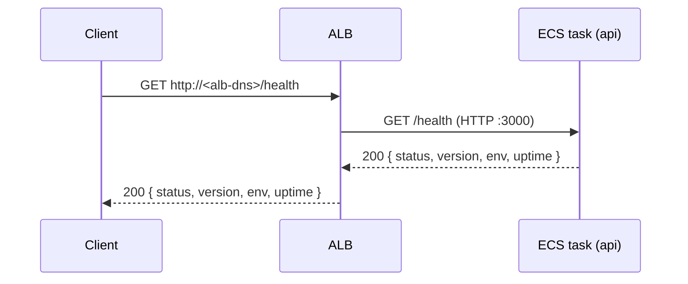
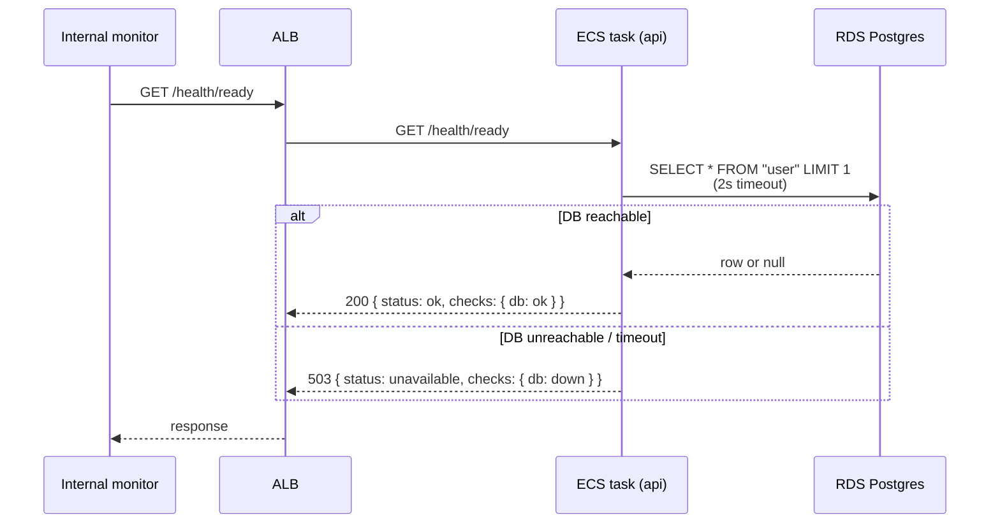

# Endpoints

Per-route documentation for everything the API exposes — request/response shape, sequence diagrams where useful, auth requirement, side effects.

Read alongside `system-design.md` (the deployed topology) and `.claude/memory/project_overview.md` (the design intent).

## Path conventions

- All application routes live under `/api/*`. CloudFront forwards only that prefix to the ALB; the SPA bundle is served from the same distribution at `/`.
- Health checks are the exception — `/health` and `/health/ready` stay un-prefixed because the ALB target-group health check hits the ALB DNS directly (CloudFront does not front them) and `/health` is also the canonical route external uptime monitors poll.

## `/health`

Liveness probe used by the ALB. No DB dependency.

`version` is the git SHA the running container was built from, injected via `GIT_SHA` build arg → container env var. `env` is `'development' | 'staging' | 'production'` — the deployed AWS environment, sourced from the `APP_ENV` env var that CDK injects (distinct from `NODE_ENV`, which is `'production'` on both staging and prod). `uptime` is process uptime in whole seconds. The SPA reads `env` + `version` to render the env+SHA badge in the sidebar so staff can see at a glance which deployed binary they are talking to. There is no DNS, TLS, or domain yet — clients reach the ALB at its raw AWS DNS name on port 80.

## `/health/ready`

Readiness probe used by internal monitoring. Hits the DB.

Failures here do **not** pull tasks out of rotation — ALB only watches `/health`. A flaky readiness probe surfaces in the monitoring dashboard rather than blackholing traffic.

## `/api/auth/*`

Better-auth-mounted routes. Self-hosted email + password auth with DB-backed cookie sessions.

| Route | Method | Purpose |
|---|---|---|
| `/api/auth/sign-up/email` | POST | Create user, set session cookie |
| `/api/auth/sign-in/email` | POST | Validate credentials, set session cookie |
| `/api/auth/sign-out` | POST | Delete session row, clear cookie (requires `Origin` header — better-auth's CSRF check) |
| `/api/auth/get-session` | GET | Return `{ user, session }` if cookie valid, else `null` (always 200) |

Mounted via `app.on(['POST', 'GET'], '/api/auth/*', (c) => auth.handler(c.req.raw))` with `basePath: '/api/auth'` on the better-auth config. better-auth signs cookies with `BETTER_AUTH_SECRET` (Secrets Manager → ECS env var); `BETTER_AUTH_URL` (CDK-injected CloudFront URL in production, ALB DNS for the API task before CloudFront fronted) is the canonical base URL it uses for OAuth callbacks and email links. Sessions persist in the `session` table; auth credentials in `account.password` (scrypt, JS-native, no separate hashing service).

Each row in `user`/`session`/`account`/`verification` carries a prefixed `entity_id` (`usr_…`, `sess_…`, etc.) and the `request_id` of the HTTP request that created it. Auth lifecycle events (signup, login, logout) write rows to the `audit_log` table via better-auth's `databaseHooks.<model>.<event>.after`, awaited but error-swallowed (best-effort) — see the audit-log section of the `database` skill for the action union, write path, and retention rules.

Email verification, OAuth providers, password reset, magic link, 2FA, organisations, and rate limiting all defer to follow-up PRs.

## `/api/audit-log/*`

Read-only views over the `audit_log` table. Gated by the `requireStaff` middleware (`apps/api/src/middleware/require-staff.ts`) — every route returns **401** without a session cookie and **403** for an authenticated user whose `staffRole` is `null`. Powered by `apps/internal`; no other consumer today.

| Route | Method | Purpose |
|---|---|---|
| `/api/audit-log` | GET | Paginated event list. Filters: `action`, `from`, `to`, `requestId`. Cursor pagination via `nextCursor`. |
| `/api/audit-log/actions` | GET | Distinct list of action strings present in the table — feeds the dropdown in the SPA filter bar. |
| `/api/audit-log/:entityId` | GET | Single event by `aud_…` entityId. **404** if the row does not exist. |

Each row response includes `actorUser` (joined from `User` by `actorUserId`) and `actorImpersonator` (when set). The `details` JSON column is returned as-is — see the `database` skill for what is and isn't safe to put there.

## `/api/orgs/*`

Multi-tenancy primitives: organisations, the M:N memberships join carrying role, and the team-signup composite endpoint. Organisations have an `entityId` (`org_…`) but no slug yet — URLs use the entityId. Routes are gated by three middlewares from `apps/api/src/middleware/require-org-role.ts` (`requireMember`, `requireAdmin`, `requireOwner`), each of which loads the caller's `Membership` and stashes it on context. All mutations write to `audit_log`.

| Route | Method | Auth | Purpose |
|---|---|---|---|
| `/api/orgs/sign-up` | POST | none | Composite team signup. Body: `{ email, password, firstname, lastname, organisationName }`, all `.strict()` so unknown fields like `inviteToken` are rejected (400). Internally calls `auth.api.signUpEmail` then `service.createOrg` and returns `{ user, organisation, membership }` with the better-auth session cookie. Single-user-product forks skip this endpoint and use `/api/auth/sign-up/email` instead. |
| `/api/orgs` | GET | session | List every org the caller is a member of. Returns `[{ organisation, membership: { role, createdAt } }]`. |
| `/api/orgs` | POST | session | Create an additional org. Caller becomes `owner`. Returns `{ organisation, membership }`. |
| `/api/orgs/:orgId` | GET | member | `{ organisation, membership }`. **404** for non-members (deliberate — collapses "doesn't exist" with "not a member" so non-members can't enumerate orgs). |
| `/api/orgs/:orgId` | PATCH | admin | Update name. Body: `{ name }`. Audit event `organisation.name_changed`. |
| `/api/orgs/:orgId/members` | GET | member | `[{ membership, user: { entityId, email, firstname, lastname } }]`. |
| `/api/orgs/:orgId/members/:userId` | PATCH | owner | Body: `{ role: 'owner' \| 'admin' \| 'member' }`. Promote-to-owner creates a co-owner; demote-only-owner returns **409** `LastOwnerRequired`. Audit event `organisation.member.role_changed`. |
| `/api/orgs/:orgId/members/:userId` | DELETE | admin | Remove a member. Admins can only remove members; only owners can remove admins or owners (**403** `InsufficientRole` otherwise). Last-owner check returns **409**. Audit event `organisation.member.removed`. |
| `/api/orgs/:orgId/leave` | POST | member | Remove the caller's own membership. Sole owner trying to leave returns **409** `LastOwnerRequired`. Audit event `organisation.member.left`. |
| `/api/orgs/:orgId/transfer-ownership` | POST | owner | Atomic step-down. Body: `{ newOwnerUserId }`. Promotes target to `owner` and demotes caller to `admin` in one transaction. Audit event `organisation.ownership.transferred`. |

`:userId` in URLs is the user's `entityId` (`usr_…`), not better-auth's internal `id`.

### Status code deviations

| Flow | Expected | Actual |
|---|---|---|
| `/api/orgs/sign-up` with already-registered email | 409 | **422** (better-auth's response is forwarded verbatim — `FAILED_TO_CREATE_USER`) |
| Fetching an org you're not a member of | 403 | **404** (no enumeration) |

## `/api/orgs/:orgId/invitations/*` and `/api/invitations/*`

Email-based invitations split across two route groups: org-scoped routes (admin/owner only) for issuing and managing invites, and public-ish token-keyed routes (the bearer token IS the auth) for previewing and accepting. Implemented in `apps/api/src/modules/org-invitations/` — separate from the orgs module so it can grow (email worker, bulk import, etc.) without bloating the orgs surface.

Tokens are 32 random bytes, base64url-encoded (~43 chars). The raw token is **never stored** — only its sha256 hex hash. The raw token is returned exactly once, in the create response, embedded in a relative `link: '/accept-invite?token=…'`. SES is not yet wired so the inviter sends the link out of band; once email transport lands a worker will consume an `invitation.created` event and render the message. Outstanding-invite uniqueness is enforced at the DB via a partial unique index `(organisation_id, email) WHERE accepted_at IS NULL AND revoked_at IS NULL`.

| Route | Method | Auth | Purpose |
|---|---|---|---|
| `/api/orgs/:orgId/invitations` | POST | admin | Create an invite. Body: `{ email, role: 'admin' \| 'member' }`. Admins can only invite `member`; only owners can invite `admin` (**403** `InsufficientRole` otherwise). Outstanding-invite collision returns **409** `OutstandingInvitationExists`. Response: `{ invitation: <metadata>, link: '/accept-invite?token=…' }` (the token-bearing `link` is only ever returned here). Audit event `organisation.member.invited`. |
| `/api/orgs/:orgId/invitations` | GET | admin | List invitations. Default `?status=pending` returns only non-accepted, non-revoked, non-expired rows; `?status=all` includes terminal states. Tokens (raw or hashed) are never exposed. |
| `/api/orgs/:orgId/invitations/:invitationId` | DELETE | admin | Revoke a pending invite. **409** if already accepted or already revoked. Audit event `organisation.invitation.revoked`. |
| `/api/invitations/:token` | GET | none | Public preview so an unauthenticated user clicking the link can decide to sign up or sign in. Returns `{ organisation: { entityId, name }, role, email, invitedBy: { firstname, lastname }, expiresAt, status }`. **404** for unknown tokens. |
| `/api/invitations/:token/accept` | POST | session | Consume the invite. Validates not-expired / not-revoked / not-already-accepted, then enforces `session.user.email === invitation.email` (**403** `InvitationEmailMismatch` otherwise). If the caller is already a member, marks the invite accepted but does not create a duplicate membership (response includes `alreadyMember: true`); otherwise creates the membership. Audit event `organisation.invitation.accepted`. |

### Status code deviations

| Flow | Expected | Actual |
|---|---|---|
| Accepting an invite while already a member of that org | 409 | **200** with `alreadyMember: true` (the user-facing outcome — "you're a member" — is true either way; tossing 409 makes UX worse) |

The `link` returned from create-invitation is a relative path: it's rendered by `apps/web` at the `/accept-invite?token=…` route, which calls the public preview and authed accept endpoints above. The consumer (inviter copying the link, or a future SES email worker) prefixes the `apps/web` host. `apps/internal` does not implement this route — invite acceptance is a customer surface, not a staff one.
| Expired invite | 410 Gone | **409** `Expired` (we use 409 for every invite-state mismatch for consistency) |
| Revoked invite | 410 / 404 | **409** `AlreadyRevoked` |

### Status code deviations from typical REST

Better-auth returns its own codes for some flows; the integration tests pin the actual values:

| Flow | Expected | Actual |
|---|---|---|
| Duplicate-email signup | 409 | **422** (`FAILED_TO_CREATE_USER`) |
| Sign-out success | 204 | **200** |
| Sign-out without `Origin` header | — | **403** (`MISSING_OR_NULL_ORIGIN`) |
| Get-session without cookie | — | **200 `null`** (deliberate convention, not 401) |

## Convention for new endpoints

When adding a route:

1. Add a section here (alphabetical-ish within the file; group related routes under one heading like `/auth/*`).
2. Include a sequence diagram only if the request flow involves more than one hop (browser → ALB → ECS → ...) or has interesting branching. Inline text is fine for single-step flows.
3. Document status-code deviations from typical REST conventions in a table at the end of the section.
4. Cross-reference to skills (`auth`, `database`) rather than duplicating their content.
