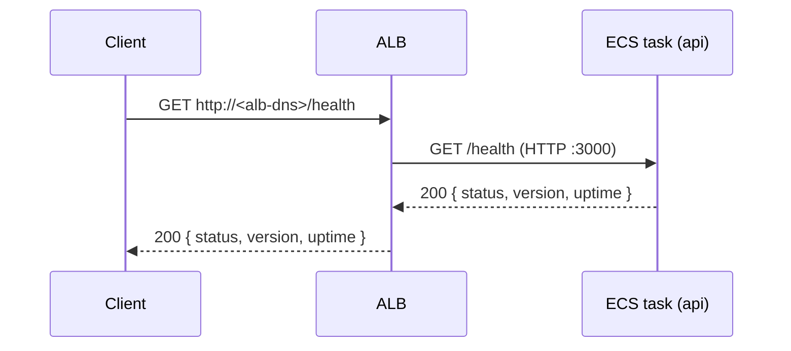
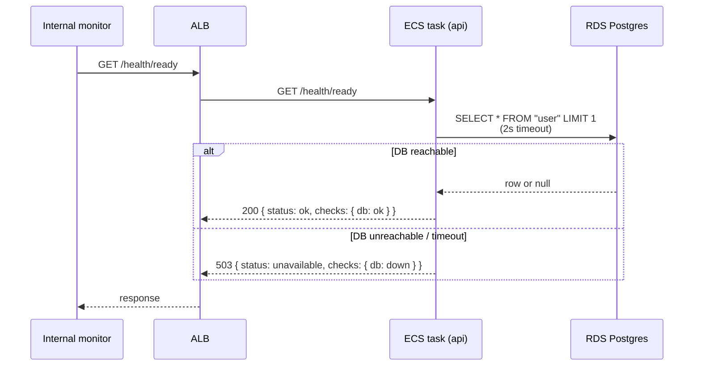

# Endpoints

Per-route documentation for everything the API exposes — request/response shape, sequence diagrams where useful, auth requirement, side effects.

Read alongside `system-design.md` (the deployed topology) and `.claude/memory/project_overview.md` (the design intent).

## `/health`

Liveness probe used by the ALB. No DB dependency.

`version` is the git SHA the running container was built from, injected via `GIT_SHA` build arg → container env var. `uptime` is process uptime in whole seconds. There is no DNS, TLS, or domain yet — clients reach the ALB at its raw AWS DNS name on port 80.

## `/health/ready`

Readiness probe used by internal monitoring. Hits the DB.

Failures here do **not** pull tasks out of rotation — ALB only watches `/health`. A flaky readiness probe surfaces in the monitoring dashboard rather than blackholing traffic.

## `/auth/*`

Better-auth-mounted routes. Self-hosted email + password auth with DB-backed cookie sessions.

| Route | Method | Purpose |
|---|---|---|
| `/auth/sign-up/email` | POST | Create user, set session cookie |
| `/auth/sign-in/email` | POST | Validate credentials, set session cookie |
| `/auth/sign-out` | POST | Delete session row, clear cookie (requires `Origin` header — better-auth's CSRF check) |
| `/auth/get-session` | GET | Return `{ user, session }` if cookie valid, else `null` (always 200) |

Mounted via `app.on(['POST', 'GET'], '/auth/*', (c) => auth.handler(c.req.raw))`. better-auth signs cookies with `BETTER_AUTH_SECRET` (Secrets Manager → ECS env var); `BETTER_AUTH_URL` (CDK-injected ALB DNS) is the canonical base URL it uses for OAuth callbacks and email links. Sessions persist in the `session` table; auth credentials in `account.password` (scrypt, JS-native, no separate hashing service).

Each row in `user`/`session`/`account`/`verification` carries a prefixed `entity_id` (`usr_…`, `sess_…`, etc.) and the `request_id` of the HTTP request that created it. Auth lifecycle events (signup, login, logout) write rows to the `audit_log` table via better-auth's `databaseHooks.<model>.<event>.after`, awaited but error-swallowed (best-effort) — see the audit-log section of the `database` skill for the action union, write path, and retention rules.

Email verification, OAuth providers, password reset, magic link, 2FA, organisations, and rate limiting all defer to follow-up PRs.

### Status code deviations from typical REST

Better-auth returns its own codes for some flows; the integration tests pin the actual values:

| Flow | Expected | Actual |
|---|---|---|
| Duplicate-email signup | 409 | **422** (`FAILED_TO_CREATE_USER`) |
| Sign-out success | 204 | **200** |
| Sign-out without `Origin` header | — | **403** (`MISSING_OR_NULL_ORIGIN`) |
| Get-session without cookie | — | **200 `null`** (deliberate convention, not 401) |

## Convention for new endpoints

When adding a route:

1. Add a section here (alphabetical-ish within the file; group related routes under one heading like `/auth/*`).
2. Include a sequence diagram only if the request flow involves more than one hop (browser → ALB → ECS → ...) or has interesting branching. Inline text is fine for single-step flows.
3. Document status-code deviations from typical REST conventions in a table at the end of the section.
4. Cross-reference to skills (`auth`, `database`) rather than duplicating their content.
