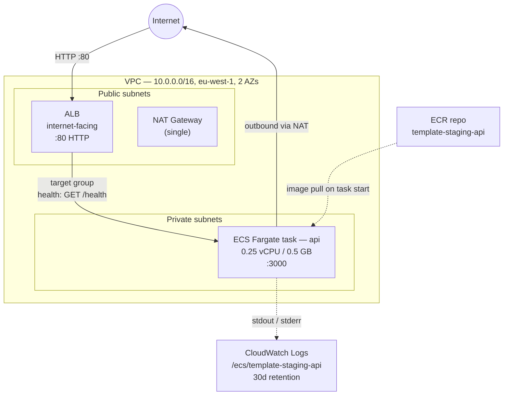
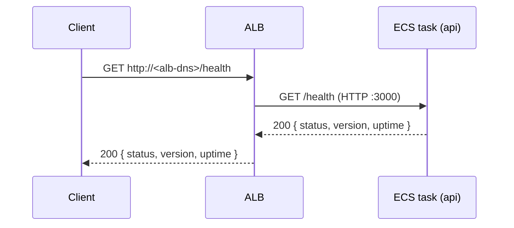
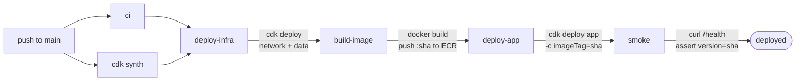

# System design

Current topology of what is actually deployed. Updated as resources are added or removed. Read alongside `.claude/memory/project_overview.md` (the design intent) and `.claude/memory/progress.md` (the chronological log).

This document only covers **staging** at the moment. Production stacks are *defined* in CDK (`bin/app.ts` instantiates them) but never deployed by any workflow yet — they will get their own diagram when a `deploy-production` workflow lands.

## AWS infra (staging)

**Security groups**
- `albSg`: inbound `:80` from `0.0.0.0/0`
- `ecsSg`: inbound `:3000` from `albSg` only
- All other inbound denied (default)

**Stacks** (CloudFormation)
- `template-staging-network` — VPC, NAT, security groups
- `template-staging-data` — ECR repo (lifecycle: keep last 30 untagged, expire untagged > 14 days; `removalPolicy: DESTROY`, `autoDeleteImages`)
- `template-staging-app` — ECS cluster, Fargate service, task def, ALB, target group, listener, log group

All stacks have `terminationProtection: false` so `cdk destroy "template-staging-*"` tears them down without manual intervention.

## Request path

`version` is the git SHA the running container was built from, injected via `GIT_SHA` build arg → container env var. `uptime` is process uptime in whole seconds. There is no DNS, TLS, or domain yet — clients reach the ALB at its raw AWS DNS name on port 80.

## Deploy flow

- All deploy jobs run only on `push` to `main`, gated by `[ci, cdk]` passing.
- AWS access via OIDC (`AWS_DEPLOY_ROLE_ARN` in the `staging` GitHub Environment).
- `deploy-app` uses `cdk deploy --exclusively` so it does not re-confirm the network and data stacks.
- The smoke step polls `/health` for up to 5 minutes and asserts the response's `version` matches the pushed SHA — catches "deploy succeeded but rolling update did not actually swap the image".

## External integrations

None at the moment.

Stripe / SES / Sentry / OAuth providers will get their own subsection here as they are wired in.

## What is NOT deployed (yet)

These are designed for in `project_overview.md` but absent from the live system:

- **Data**: RDS Postgres, ElastiCache Redis, S3 (uploads), Secrets Manager
- **Edge**: Route53, ACM, CloudFront, HTTPS / TLS, custom domain
- **Apps**: `apps/worker` (BullMQ consumer), `apps/web`, `apps/internal`, `apps/portal`
- **Packages**: `packages/auth`, `packages/db`, `packages/billing`, `packages/errors`, `packages/types`, `packages/schemas`, etc.
- **Workflows**: `deploy-production.yml`, promote-by-image cross-env retag
- **IAM**: deploy roles still hold `AdministratorAccess` — tightening deferred per `docs/runbooks/github-oidc-setup.md`
- **Production env**: stacks compile during `cdk synth` but no workflow deploys them; sizing is identical to staging (parameterise when production actually runs)
