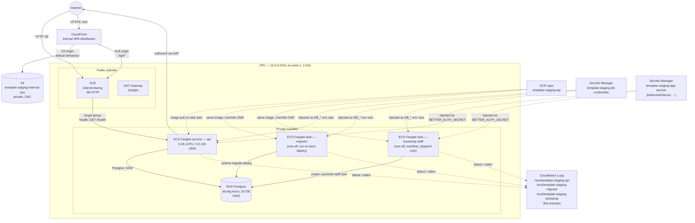
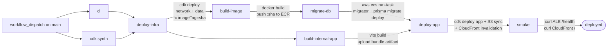

# System design

Current topology of what is actually deployed. Updated as resources are added or removed. Read alongside `.claude/memory/project_overview.md` (the design intent) and `.claude/memory/progress.md` (the chronological log).

This document only covers **staging** at the moment. Production stacks are *defined* in CDK (`bin/app.ts` instantiates them) but never deployed by any workflow yet — they will get their own diagram when a `deploy-production` workflow lands.

## AWS infra (staging)

**Security groups**
- `albSg`: inbound `:80` from `0.0.0.0/0`
- `ecsSg`: inbound `:3000` from `albSg` only
- `rdsSg`: inbound `:5432` from `ecsSg` only
- All other inbound denied (default)

**Stacks** (CloudFormation)
- `template-staging-network` — VPC, NAT, security groups
- `template-staging-data` — ECR repo, RDS Postgres, Secrets Manager DB credentials + app-secrets, ECS cluster, migrator + bootstrap-staff task definitions and their log groups
- `template-staging-app` — Fargate service, API task def, ALB, target group, listener, API log group, internal SPA S3 bucket + CloudFront distribution

All stacks have `terminationProtection: false` so `cdk destroy "template-staging-*"` tears them down without manual intervention.

## Request paths

Per-route documentation lives in [`docs/endpoints.md`](endpoints.md) — request/response shape, sequence diagrams, status-code deviations, and the convention for adding new routes. This file (`system-design.md`) covers infra topology and deploy mechanics only.

## Deploy flow

- Deploy jobs run on `workflow_dispatch` (manual trigger from the Actions tab) on `main`, gated by `[ci, cdk]` passing. _(Note: while the template is being scaffolded, deploys are gated on `workflow_dispatch` rather than push — see `docs/runbooks/staging-teardown-and-redeploy.md`.)_
- AWS access via OIDC (`AWS_DEPLOY_ROLE_ARN` in the `staging` GitHub Environment).
- `deploy-infra` passes `imageTag` so the migrator task definition references the SHA `build-image` is about to push. CFN doesn't validate ECR image existence at deploy time, so referring to a not-yet-pushed tag is fine.
- `build-internal-app` runs in parallel with `build-image` and uploads the Vite bundle as a workflow artifact for `deploy-app`. Each future SPA gets its own job (`build-web-app`, `build-portal-app`).
- `migrate-db` invokes `aws ecs run-task` against the migrator task definition, waits for it to stop, and fails the workflow on a non-zero exit (dumping the last 5 minutes of `/ecs/template-staging-migrator` logs).
- `deploy-app` uses `cdk deploy --exclusively` so it does not re-confirm the network and data stacks. After the stack converges it downloads the SPA artifact, two-pass-syncs it to S3 (long-cache + immutable for hashed assets, no-cache for `index.html`), and invalidates `/` + `/index.html` on CloudFront so the new shell ships immediately.
- The smoke step polls the ALB `/health` for up to 5 minutes (asserting `version` matches the pushed SHA) and curls CloudFront for the SPA shell (asserting the response contains `id="root"`).

### bootstrap-staff (sibling workflow)

`.github/workflows/bootstrap-staff.yml` is a separate `workflow_dispatch`-only workflow — never on push, never on schedule, never wired into the main deploy DAG. It runs `aws ecs run-task` against the `template-${env}-bootstrap` task definition with the four `BOOTSTRAP_STAFF_*` inputs passed as **runtime env overrides** on the container. No long-lived bootstrap secrets exist on the task definition or in Secrets Manager. See [`docs/runbooks/staff-bootstrap.md`](runbooks/staff-bootstrap.md).

## External integrations

None at the moment.

Stripe / SES / Sentry / OAuth providers will get their own subsection here as they are wired in.

## What is NOT deployed (yet)

These are designed for in `project_overview.md` but absent from the live system:

- **Data**: ElastiCache Redis, S3 (uploads). (Application-level Secrets Manager secret `${PRODUCT}-${env}-app-secrets` IS deployed and currently holds `betterAuthSecret`; future fields like `stripeSecretKey` add to the same JSON document.)
- **Edge**: Route53, ACM, HTTPS on the ALB, custom domain. (CloudFront IS deployed for the internal SPA — backed by an S3 origin for `/*` and the ALB origin for `/api/*`. Route53 + ACM still pending so the SPA is served from the CloudFront default `*.cloudfront.net` domain.)
- **Apps**: `apps/worker` (BullMQ consumer), `apps/web`, `apps/portal`. (`apps/internal` IS deployed: login + audit-log list/detail behind a `staffRole` gate.)
- **Packages**: `packages/auth` (better-auth wired inline at `apps/api/src/lib/auth.ts` until a second consumer arrives), `packages/db`, `packages/billing`, `packages/errors`, `packages/types`, `packages/schemas`, etc.
- **Workflows**: `deploy-production.yml`, promote-by-image cross-env retag
- **IAM**: deploy roles still hold `AdministratorAccess` — tightening deferred per `docs/runbooks/github-oidc-setup.md`
- **Production env**: stacks compile during `cdk synth` but no workflow deploys them; sizing is identical to staging (parameterise when production actually runs)
