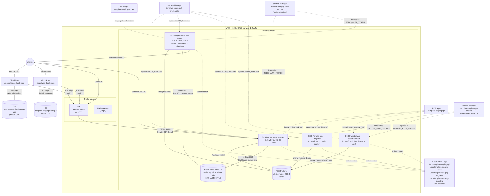
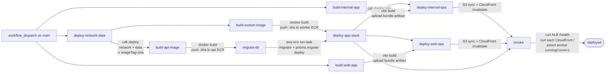

# System design

Current topology of what is actually deployed. Updated as resources are added or removed. Read alongside `.claude/memory/project_overview.md` (the design intent) and `.claude/memory/progress.md` (the chronological log).

This document only covers **staging** at the moment. Production stacks are *defined* in CDK (`bin/app.ts` instantiates them) but never deployed by any workflow yet — they will get their own diagram when a `deploy-production` workflow lands.

## AWS infra (staging)



**Security groups**
- `albSg`: inbound `:80` from `0.0.0.0/0`
- `ecsSg`: inbound `:3000` from `albSg` only
- `rdsSg`: inbound `:5432` from `ecsSg` only
- `redisSg`: inbound `:6379` from `ecsSg` only
- All other inbound denied (default)

**Stacks** (CloudFormation)
- `template-staging-network` — VPC, NAT, security groups
- `template-staging-data` — ECR repos (api + worker), RDS Postgres, ElastiCache Valkey 8 replication group, Secrets Manager (DB credentials + app secrets + redis secrets + stripe secrets), ECS cluster, migrator + bootstrap-staff task definitions and their log groups
- `template-staging-email` — *(optional)* SES `EmailIdentity` + DKIM (auto-CNAMEs via Route53 hosted-zone lookup) + a default `ConfigurationSet`. Only instantiated when the fork passes `-c emailDomain.staging=mail.example.com`. Without it the worker keeps `LogOnlySender` and no SES IAM grants are added.
- `template-staging-app` — Fargate services (api + worker), task defs, ALB, target group + listener for api, log groups, internal + web SPA S3 buckets + CloudFront distributions (one per SPA). When `template-staging-email` is present, the worker container env gets `EMAIL_FROM` + `EMAIL_CONFIGURATION_SET` and the worker task role is granted `ses:SendEmail` / `ses:SendRawEmail` scoped to the SES `EmailIdentity` ARN. `AWS_REGION` and `WEB_BASE_URL` are always injected on the worker container.

All stacks have `terminationProtection: false` so `cdk destroy "template-staging-*"` tears them down without manual intervention.

## Request paths

Per-route documentation lives in [`docs/endpoints.md`](endpoints.md) — request/response shape, sequence diagrams, status-code deviations, and the convention for adding new routes. This file (`system-design.md`) covers infra topology and deploy mechanics only.

## Deploy flow

Two workflow files own the staging deploy story:

- **`.github/workflows/ci.yml`** — PR + push validation only. Jobs: `ci`, `cdk-synth`, `commitlint` (PR), `build-api-image` (PR sanity), `build-worker-image` (PR sanity), `build-internal-app` (PR sanity), `build-web-app` (PR sanity).
- **`.github/workflows/deploy-staging.yml`** — `workflow_dispatch`-only deploy DAG.



- The deploy DAG is `workflow_dispatch`-only (manual trigger from the Actions tab). Operator discipline: trigger only after the green check from `ci.yml` on the same SHA. There is no in-workflow gate yet — see `docs/tickets/09-ci-workflow-reorg.md` for when to add one.
- AWS access via OIDC (`AWS_DEPLOY_ROLE_ARN` in the `staging` GitHub Environment).
- `deploy-network-data` passes `imageTag` so the migrator + bootstrap-staff task definitions reference the SHA `build-api-image` is about to push. CFN doesn't validate ECR image existence at deploy time, so referring to a not-yet-pushed tag is fine.
- `build-internal-app` and `build-web-app` run in parallel with everything that doesn't need them; each artifact is consumed by the matching `deploy-<name>-spa` job. Future SPAs (`apps/portal` etc.) follow the same `build-<name>` + `deploy-<name>-spa` pair.
- `migrate-db` invokes `aws ecs run-task` against the migrator task definition, waits for it to stop, and fails the workflow on a non-zero exit (dumping the last 5 minutes of `/ecs/template-staging-migrator` logs).
- `deploy-app-stack` uses `cdk deploy --exclusively` so it does not re-confirm the network and data stacks.
- `deploy-internal-spa` and `deploy-web-spa` download their respective artifacts, two-pass-sync to S3 (long-cache + immutable for hashed assets, no-cache for `index.html`), and invalidate `/` + `/index.html` on the matching CloudFront distribution. Both sequenced after `deploy-app-stack` so the distributions exist.
- The smoke step polls the ALB `/health` for up to 5 minutes (asserting `version` matches the pushed SHA) and iterates over each CloudFront distribution, asserting the response contains `id="root"`.

### bootstrap-staff (sibling workflow)

`.github/workflows/bootstrap-staff.yml` is a separate `workflow_dispatch`-only workflow — never on push, never on schedule, never wired into the main deploy DAG. It runs `aws ecs run-task` against the `template-${env}-bootstrap` task definition with the four `BOOTSTRAP_STAFF_*` inputs passed as **runtime env overrides** on the container. No long-lived bootstrap secrets exist on the task definition or in Secrets Manager. See [`docs/runbooks/staff-bootstrap.md`](runbooks/staff-bootstrap.md).

## External integrations

### SES (optional)

The email path is fork-opt-in. The transactional flow is:

```
event (e.g. invitation.created)
  → BullMQ `emails` queue
  → worker subscriber renders react-email template
  → @template/email `sendEmail()` upserts a `sent_emails` row (dedupe + history)
  → transport-selector picks
      • MailpitSender   when APP_ENV=local
      • SesSender       when EMAIL_FROM is set (deployed env with EmailStack)
      • LogOnlySender   otherwise (deploys without SES still succeed)
```

- **EmailStack** (CDK) verifies the sending domain via SES `EmailIdentity` + auto-DKIM through Route53. Only created when the fork supplies `-c emailDomain.<env>=...`. SES production-access (out of sandbox) is a manual AWS support ticket — out of CDK's scope.
- **`sent_emails` table** (Postgres) is the durable history + idempotency anchor. `dedupe_key` is unique; second attempts with the same key are a no-op once `sent_at` is populated. Admin SPA reads `/api/admin/sent-emails` to render the list + detail view at `apps/internal /emails`.
- **Local dev** uses Mailpit (docker-compose service on `:1025` for SMTP, `:8025` for the web UI). No SES credentials required locally.

### Stripe (optional)

Per-organisation Stripe subscription. Like SES, this surface is fork-opt-in — until the Stripe secrets are populated and the price-id context flag is supplied, the routes return a clean "billing not configured" 500 and the SPA's paywall guard never fires.

```
sign up                             /signup auto-creates a Personal org (one txn)
  ↓
click into org                      /orgs/$orgId/* → OrgPaywallGate fires
  ↓
paywalled                           redirect to /onboarding/subscribe?orgId=…
  ↓
POST /billing/checkout-session      Stripe Checkout URL → window.location
  ↓
Stripe Checkout completes           customer + subscription created in Stripe
  ↓
Stripe → POST /api/webhooks/stripe  raw-body signature check → stripe_event id
                                    insert (idempotency anchor) → UPSERT
                                    subscription mirror + link customer to org
  ↓
SPA polls access-state              flips to `paid` → routes into the org
```

- **`packages/billing`** — Stripe SDK wrapper. `getOrgAccessState(orgId)` (the sole paywall resolver: `paid | past_due | paywalled`). Checkout + Customer Portal helpers. `isBillingConfigured()` predicate gating real Stripe-touching routes. Single Pro plan in `entitlements.ts` for now — multi-plan is a follow-up ticket.
- **`subscription` table** (Postgres) is the mirror — one row per org, UPSERTed by the webhook. `getOrgAccessState` reads it. Re-subscribing after cancel rotates `stripe_subscription_id` on the same row.
- **`stripe_event` table** — idempotency anchor. Insert before processing; the unique-id collision short-circuits Stripe's automatic retries on the same event. Payload deliberately not stored (Stripe's dashboard is the archive).
- **CDK secrets**: `template-${env}-stripe-secrets` Secrets Manager entry holds `apiKey` + `webhookSecret` (operator-supplied; empty by default). Injected on api + worker containers as `STRIPE_API_KEY` + `STRIPE_WEBHOOK_SECRET`. Non-secret env (`STRIPE_PRICE_ID_PRO`, `STRIPE_PORTAL_RETURN_URL`, `WEB_BASE_URL`) is set by AppStack — the price id is fork-supplied via `-c stripePriceIdPro.<env>=price_…`.
- **Customer Portal** handles change-card / cancel / view-invoices — we don't reimplement any of it. `apps/web /orgs/$orgId/settings/billing` mints a Portal session and redirects there.
- **Local dev** uses Stripe test mode + the Stripe CLI (`stripe listen --forward-to localhost:3000/api/webhooks/stripe`). No mock layer. See [`docs/runbooks/billing-smoke.md`](runbooks/billing-smoke.md).
- **Out of scope for the spine** (separate tickets): per-seat sync, comp grants, conversion nudges, internal-app refund / cancel / invoice-history UI, multi-plan pricing page, `past_due` banner, `invoices` mirror table.

Sentry / OAuth providers will get their own subsections here as they are wired in.

## What is NOT deployed (yet)

These are designed for in `project_overview.md` but absent from the live system:

- **Data**: S3 (uploads). (Application-level Secrets Manager secret `${PRODUCT}-${env}-app-secrets` IS deployed and currently holds `betterAuthSecret`; future fields like `stripeSecretKey` add to the same JSON document. ElastiCache Valkey 8 IS deployed alongside RDS — used by BullMQ for queues, schedules, and the outbox publisher.)
- **Edge**: Route53, ACM, HTTPS on the ALB, custom domain. (CloudFront IS deployed — one distribution per SPA, each backed by an S3 origin for `/*` and the ALB origin for `/api/*`. Route53 + ACM still pending so each SPA is served from its CloudFront default `*.cloudfront.net` domain.)
- **Apps**: `apps/portal`. (`apps/internal`, `apps/web`, `apps/worker` IS deployed.)
- **Packages**: `packages/auth` (better-auth wired inline at `apps/api/src/lib/auth.ts` until a second consumer arrives), `packages/billing`, `packages/types`, `packages/schemas`, etc. (`packages/db`, `packages/errors`, `packages/events` IS shipped.)
- **Workflows**: `deploy-production.yml`, promote-by-image cross-env retag
- **IAM**: deploy roles still hold `AdministratorAccess` — tightening deferred per `docs/runbooks/github-oidc-setup.md`
- **Production env**: stacks compile during `cdk synth` but no workflow deploys them; sizing is identical to staging (parameterise when production actually runs)
